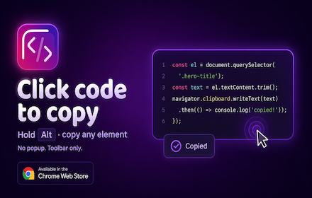
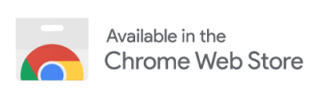

  
  <h1>Code Copy</h1>
  
  
<strong>Click code to copy.</strong> Hold <kbd>Alt</kbd> to copy text from any element.

  
Toolbar toggle. One tab at a time. No popup.

---

Chrome extension (Manifest V3). Copies **innerText** to the clipboard.

## Usage

### Per-tab toggle

You enable Code Copy on each tab separately.

Click the **toolbar icon** or press **Alt+C** to turn copying on or off on the tab you are viewing.

- **Gray icon:** off on this tab.
- **Color icon:** active on this tab.
- **Other tabs:** each keeps its own state. The icon shows the focused tab.
- **After navigation:** enable again on the new page.

Remap at `chrome://extensions/shortcuts` if **Alt+C** clashes with the site or browser.

### Code blocks

Click a `<code>` element, or a `<pre>` with no nested `<code>` and some text inside. You get a **Copied** toast and a short highlight on the block.

### Any element (Alt pick)

1. Hold **Alt**. The copy cursor appears; text under the pointer gets an outline.
2. Click while **Alt** stays down. That element's innerText goes to the clipboard. Empty nodes, `<html>`, and `<body>` are skipped.

**Alt** picks elements. **Alt+C** toggles the extension on or off.

### Feedback

Toasts: **Copied**, **Copy failed**, **Code Copy Activated**, **Code Copy Deactivated**.

## Scope

| Runs on | Does not run on |
|--------|------------------|
| `http://` and `https://` pages (after you enable on that tab) | `file://`, `chrome://`, Web Store, etc. |
| Most public sites | `localhost`, `127.0.0.1`, `0.0.0.0` |

Copies **innerText**: the text as laid out on the page.

## Install

  <a href="https://chromewebstore.google.com/detail/code-copy/pmohebgglggkhehmhbofgbhfgadpjjpc">Install from the Chrome Web Store</a>
  

### Development

1. Open `chrome://extensions`, turn on **Developer mode**, **Load unpacked**, pick this directory.
2. First load opens the welcome window (`welcome.html`).
3. After code changes, **Reload** the extension, then click the toolbar icon or press **Alt+C** on the tab.

Open the welcome page again: reinstall unpacked, or run `chrome.windows.create({ url: chrome.runtime.getURL('welcome.html') })` from the service worker console on `chrome://extensions`.

Store ZIP: `.dev/store-launch/package.sh` writes `dist/codecopy-v*.zip`.

## Permissions

| Permission | Why |
|------------|-----|
| `activeTab` | Inject copy handlers after toolbar click or Alt+C |
| `storage` | Per-tab on/off state for the browser session |
| `scripting` | Inject bundled CSS and JS |
| `tabs` | Match toolbar icon to the focused tab; reset after navigation |

## License

[MIT](LICENSE)
